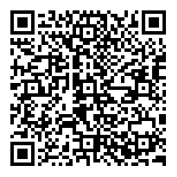

# PayBySquare Java Library

A Java library for generating PayBySquare QR codes according to the Slovak [PayBySquare standard v1.1.0](https://www.sbaonline.sk/wp-content/uploads/2020/03/pay-by-square-specifications-1_1_0.pdf).

If you like this library, please give it a star, so I know someone uses it.

## Overview

This library provides an implementation of the PayBySquare standard, including:

1.  **Data Modeling**: POJOs for the PayBySquare schema.
2.  **Serialization**: Conversion to the required tab-separated format.
3.  **Encoding**: CRC32 checksum, LZMA compression (with specific parameters), bit-stuffing, and Base32hex encoding.
4.  **QR Generation**: Creating the final QR code image using ZXing.

Reading the resulting QR code or the string it represents, is not implemented (yet).

### Sample output

The library doesn't support any styling, just a bare QR code.



### Implementation notes

The library does not validate values set from the business perspective, so if not sure, consult [the standard](https://www.sbaonline.sk/wp-content/uploads/2020/03/pay-by-square-specifications-1_1_0.pdf).
The API uses the same naming as the standard, so it's easy to find the corresponding section.

## Installation

### Maven

Add the following dependencies to your `pom.xml`:

```xml
<dependencies>
    <dependency>
        <groupId>io.github.janhalasa</groupId>
        <artifactId>pay-by-square-java</artifactId>
        <version>1.0.0</version>
    </dependency>
</dependencies>
```

### Gradle

```groovy
dependencies {
    compile "io.github.janhalasa:pay-by-square-java:1.0"
}
```

The library is tiny, around 15 kB.

## Usage

Here is a comprehensive example showing how to populate all fields of a `PayBySquareDocument`, including optional symbols, notes, standing orders, and direct debits.

### Simple one-time payment

This is what most people need. It creates a template for a payment identified by a variable symbol.

```java

import io.github.janhalasa.paybysquare.model.*;
import io.github.janhalasa.paybysquare.service.PayBySquareGenerator;

import java.nio.file.Files;
import java.nio.file.Path;
import java.time.LocalDate;

public class OneTimePayment {
    public static void main(String[] args) throws Exception {
        
        // 1. Create the Document
        PayBySquareDocument doc = new PayBySquareDocument();
        doc.setBeneficiaryName("Ján Halaša");

        // 2. Create a Payment
        Payment payment = new Payment();
        payment.setAmount(new BigDecimal("123.45"));
        payment.setVariableSymbol("1234567890");

        // 3. Add Bank Account (IBAN & BIC)
        BankAccount account = new BankAccount();
        account.setIban("SK3883300000002503144937");
        account.setBic("FIOZSKBAXXX");
        payment.addBankAccount(account);
        
        // Add the payment to the document
        doc.addPayment(payment);

        // 6. Generate the QR Code
        PayBySquareGenerator generator = new PayBySquareGenerator();
        byte[] qrImage = generator.generateQrCode(doc, 256); // 256x256 pixels
        Files.write(Path.of("paybysquare.png"), qrImage);
    }
}
```

### All available fields

This example showcases the use of all available fields. 
Some combinantions may not make sense, so it's good to verify how bank apps process the resulting QR code. 

```java

import io.github.janhalasa.paybysquare.model.*;
import io.github.janhalasa.paybysquare.service.PayBySquareGenerator;

import java.nio.file.Files;
import java.nio.file.Path;
import java.time.LocalDate;

public class FullExample {
    public static void main(String[] args) throws Exception {
        
        // 1. Create the Document
        PayBySquareDocument doc = new PayBySquareDocument();
        doc.setInvoiceId("INV-2023-001");
        doc.setBeneficiaryName("Ján Halaša");
        doc.setBeneficiaryAddress1("P. O. Hviezdoslava 843");
        doc.setBeneficiaryAddress2("Vyšný Kubín, Slovensko");

        // 2. Create a Payment
        Payment payment = new Payment();
        payment.setPaymentOptions(PaymentOption.PAYMENT_ORDER); // This is the default value, not necessary to be set
        payment.setAmount(new BigDecimal("123.45"));
        payment.setCurrencyCode(Payment.CURRENCY_EUR); // This is the default value, not necessary to be set
        payment.setPaymentDueDate(LocalDate.now());
        payment.setVariableSymbol("1234567890");
        payment.setConstantSymbol("0308");
        payment.setSpecificSymbol("9999");
        // This reference replaces the symbols above - use one or the other
        payment.setOriginatorsReference("/VS12345/SS9999/KS0008");
        payment.setPaymentNote("Payment for Invoice 001 - Full Service");

        // 3. Add Bank Account (IBAN & BIC)
        BankAccount account = new BankAccount();
        account.setIban("SK3883300000002503144937");
        account.setBic("FIOZSKBAXXX");
        payment.addBankAccount(account);

        // 4. (Optional) Add Standing Order details
        StandingOrder so = new StandingOrder();
        so.setDay(15);
        so.setMonth(MonthClassifier.APRIL);
        so.setPeriodicity(Periodicity.MONTHLY); // Monthly
        so.setLastDate(LocalDate.of(2027, 12, 1));
        payment.setStandingOrder(so);

        // 5. (Optional) Add Direct Debit details
        DirectDebit dd = new DirectDebit();
        dd.setDirectDebitScheme(DirectDebitScheme.SEPA);
        dd.setDirectDebitType(DirectDebitType.ONE_OFF);
        dd.setVariableSymbol("1234567890");
        dd.setSpecificSymbol("1111");
        dd.setOriginatorsReference("MANDATE-001");
        dd.setMandateID("MND-102030");
        dd.setCreditorID("CID-998877");
        dd.setContractID("CTR-554433");
        dd.setMaxAmount(new BigDecimal(500));
        dd.setValidTillDate(LocalDate.of(2030, 3, 31));
        payment.setDirectDebit(dd);

        // Add the payment to the document
        doc.addPayment(payment);

        // 6. Generate the QR Code
        PayBySquareGenerator generator = new PayBySquareGenerator();

        // Generate raw PayBySquare string (LZMA compressed, Base32hex encoded)
        // This is useful if you want to use a different library for generating the QR code
        String stringCode = generator.generateString(doc);
        System.out.println("PayBySquare String: " + stringCode);

        // Generate PNG image
        byte[] qrImage = generator.generateQrCode(doc, 256); // 256x256 pixels
        Files.write(Path.of("paybysquare.png"), qrImage);
    }
}
```

## Key Components

- **`PayBySquareDocument`**: The root object model.
- **`PayBySquareSerializer`**: Converts the object model into the flat TSV string format.
- **`PayBySquareEncoder`**: Handles CRC32, LZMA compression, custom header construction, and Base32hex encoding.
- **`PayBySquareGenerator`**: The main entry point for generating QR codes.

## Testing

Since the library supports just generation of QR codes, it's a bit hard to verify the result in a JUnit test.
So it's necessary to test the result in an existing bank application or another PayBySquare library.
I used the [pbsq-sk](https://github.com/klokain/pbsq-sk) JavaScript library to verify the results (not all fields, just basic ones).

## Standard Compliance
- **Version**: [1.1.0](https://www.sbaonline.sk/wp-content/uploads/2020/03/pay-by-square-specifications-1_1_0.pdf)
- **Compression**: LZMA (LC=3, LP=0, PB=2, Dictionary=128KB)
- **Checksum**: CRC32 (IEEE 802.3)
- **Encoding**: Base32hex
- **QR Code**: ISO/IEC 18004:2006, Alphanumeric Mode, Error Correction Level L

## License

MIT
